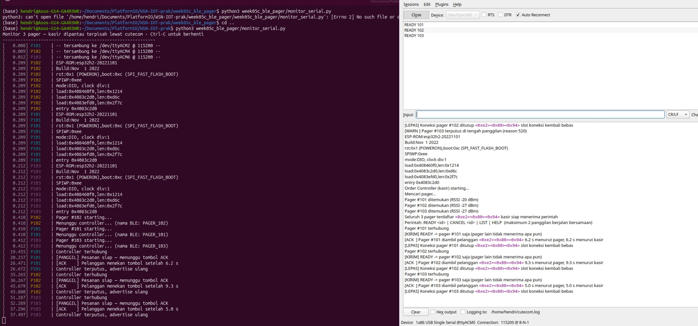

```
━━━━━━━━━━━━━━━━━━━━━━━━━━━━━━━━━━━━━━━━━━━━━━━━━━━━
               IoT COMMUNICATION LAB
   MODUL 05C — Pager Restoran: Notifikasi BLE One-to-Many

  ESP32-H2 · BLE · 1 CONTROLLER / N PAGER · Level: Intermediate
━━━━━━━━━━━━━━━━━━━━━━━━━━━━━━━━━━━━━━━━━━━━━━━━━━━━
```

## 1 · Pendahuluan

Modul 05C adalah mini project lanjutan dari `week05_ble_multinode`, dirancang untuk tiga pertemuan (3 × 50 menit) pada tingkat menengah. Misinya membangun sistem pager restoran: kasir memanggil pemilik pesanan tertentu, pager milik pelanggan itu berbunyi dan menyala, dan panggilan berhenti ketika pelanggan menekan tombol ACK. Percobaan berjalan dengan satu controller dan tiga pager, dikendalikan lewat baris perintah di Serial Monitor kasir, dengan LED RGB onboard dan buzzer sebagai penanda di sisi pelanggan. Koneksi tidak dipelihara terus-menerus ke seluruh pager, melainkan dibuka saat sebuah pager dipanggil dan ditutup setelah pelanggan menekan ACK — pilihan rancangan yang lahir dari batas perangkat keras, dan dibahas tersendiri di bagian Dasar Teori.

Modul 05 membuktikan satu central sanggup memegang beberapa koneksi sekaligus, tetapi arah datanya hanya satu: node mengirim, pusat menerima. Modul ini membalik arahnya dan menambahkan satu syarat yang jauh lebih ketat — **pesan harus sampai ke satu node tertentu saja**. Dari sinilah muncul pertanyaan yang menjadi inti modul: bagaimana memilih satu penerima di antara banyak node, dan apa bedanya dengan menyiarkan pesan ke semua orang lalu membiarkan mereka menyaring sendiri.

Prasyaratnya adalah M05 untuk koneksi ganda dan pemisahan aliran per sumber, M03 untuk characteristic sebagai kanal perintah, serta M00B untuk pembacaan tombol. Yang dibangun di sini adalah pengiriman perintah terarah lewat objek koneksi tertentu, karakteristik `WRITE` sebagai kanal perintah turun berdampingan dengan `NOTIFY` sebagai kanal status naik, pengelolaan slot koneksi yang jumlahnya terbatas, antarmuka baris perintah di sisi kasir, serta pengukuran waktu tanggap pelanggan. Semuanya dipakai lagi pada M08 ketika perintah ON/OFF Zigbee dialamatkan lewat binding, M12 ketika unicast IPv6 dibandingkan dengan multicast, dan M14 ketika topic MQTT memisahkan perintah turun dari telemetri naik.

**Yang membedakan modul ini dari M05 dan M05B**

| | M05 | M05B | M05C (ini) |
|---|---|---|---|
| Arah data utama | node → pusat | node → pusat | **pusat → node** |
| Pemicu | timer | tombol di node | **perintah kasir** |
| Tujuan pesan | satu-satunya pusat | satu-satunya hub | **satu node terpilih dari banyak** |
| Peran `WRITE` | tidak dipakai | tidak dipakai | **kanal perintah utama** |
| Umpan balik | — | kejadian sensor | **ACK dari pelanggan + waktu tanggap** |

**Kontrak data lab ini.** Perintah turun berupa kata kunci pendek (`READY`, `CANCEL`) yang ditulis ke characteristic perintah, dan status naik berbentuk `<id>:ACK:<milidetik>`. Perhatikan bahwa perintah **tidak memuat nomor pager sama sekali** — nomor tujuan sudah terkandung dalam pilihan koneksi. Ini kebalikan dari pola M05 yang menaruh identitas di dalam payload, dan perbedaan itulah yang dibahas di bagian Analisis.

## 2 · Capaian Pembelajaran

Setelah menyelesaikan modul ini, praktikan mampu:

1. Menjelaskan mengapa pengiriman ke satu node pada BLE **bukan** broadcast, dan menunjukkan di kode letak pemilihan tujuannya.
2. Membangun central yang memegang beberapa koneksi sekaligus dan mengirim perintah hanya melalui koneksi yang dipilih.
3. Merancang service dengan dua characteristic berlawanan arah: `WRITE` untuk perintah turun dan `NOTIFY` untuk status naik.
4. Membuat antarmuka operator berbasis baris perintah pada Serial Monitor, lengkap dengan penanganan perintah yang tidak sah.
5. Mengukur waktu tanggap pelanggan dari dua sisi (pager dan kasir) dan menjelaskan sumber selisihnya.

**Kriteria keberhasilan**

- ☐ Seluruh pager terdaftar di controller, dan `READY` membuka koneksi ke pager tujuan saat itu juga.
- ☐ Perintah `READY <id>` membuat **hanya** pager bernomor itu berbunyi; pager lain tidak mencetak apa pun.
- ☐ Tombol ACK menghentikan LED dan buzzer, lalu memunculkan baris `[ACK ]` di sisi kasir.
- ☐ Waktu tanggap tercatat di kedua sisi dan selisihnya dijelaskan.
- ☐ Slot koneksi dilepas otomatis setelah ACK, dan panggilan melebihi kapasitas ditolak dengan pesan yang jelas — bukan membuat controller reboot.

## 3 · Dasar Teori (secukupnya)

| Istilah | Definisi kerja di lab ini |
|---|---|
| Unicast | Pesan dikirim melalui satu koneksi menuju satu perangkat. Inilah yang dipakai modul ini. |
| Broadcast | Satu paket tersiar ke udara dan diterima siapa pun yang mendengarkan. Pada BLE hal ini hanya terjadi lewat advertising, bukan lewat koneksi. |
| Penyaringan di penerima | Pola alternatif: semua node menerima pesan yang sama, lalu membuang yang bukan miliknya. **Tidak** dipakai di sini — dan bagian Analisis membahas mengapa. |
| Characteristic `WRITE` | Kanal perintah turun. Central menulis nilai, peripheral menerimanya lewat callback `onWrite`. |
| Characteristic `NOTIFY` | Kanal status naik. Peripheral mendorong nilai ke central yang sudah subscribe. |
| Write with response | Penulisan yang ditunggu balasannya oleh central, sehingga kegagalan kirim langsung ketahuan. Dipakai agar kasir tahu perintahnya benar-benar diterima. |
| Slot koneksi | Jumlah koneksi BLE yang sanggup dipegang controller serentak. Pada ESP32-H2 di lab ini jumlahnya **dua**. |
| Sambung saat dibutuhkan | Pola pemakaian slot: koneksi dibuka ketika pager dipanggil dan ditutup setelah ACK, sehingga jumlah pager tidak dibatasi jumlah slot. |
| Waktu tanggap | Selang antara perintah `READY` dan penekanan tombol ACK — besaran yang diukur pada modul ini. |

**Mengapa ini bukan broadcast.** Secara naluri, memanggil satu pelanggan di antara banyak terasa seperti menyiarkan nomor lewat pengeras suara: satu suara, semua mendengar, hanya yang merasa dipanggil yang bereaksi. BLE berbasis koneksi bekerja sebaliknya. Controller memegang **satu tautan terpisah untuk tiap pager**, dan menulis perintah ke tautan yang dipilih saja. Pager lain tidak menyaring apa pun — paketnya memang tidak pernah dikirim kepada mereka. Konsekuensinya nyata dan bisa diamati: menambah pager berarti menambah koneksi, bukan menambah pendengar, sehingga batas jumlah pager ditentukan batas koneksi radio.

**Batas dua koneksi, dan mengapa rancangannya menjadi seperti ini.** Percobaan pertama modul ini memelihara koneksi ke ketiga pager sekaligus. Hasilnya: controller **reboot** tepat saat koneksi ketiga terbentuk, berulang kali, dengan pesan `assert failed: npl_freertos_callout_init`. Penyebabnya bukan kesalahan program, melainkan pustaka controller BLE ESP32-H2 pada Arduino core ini yang hanya menyediakan memori untuk dua koneksi serentak (`CONFIG_BT_LE_CONN_RESERVED_MEMORY_COUNT=2`). Nilai itu berada di pustaka yang sudah terkompilasi, sehingga menambahkan `-DCONFIG_BT_LE_MAX_CONNECTIONS=3` pada `build_flags` **tidak** menolong — sudah dicoba dan tetap reboot.

Jawabannya adalah mengubah cara slot dipakai, bukan memaksa menambah slot: controller menyimpan alamat seluruh pager hasil pemindaian, tetapi baru membuka koneksi ketika sebuah pager dipanggil, lalu menutupnya setelah ACK. Dengan begitu jumlah pager tidak lagi dibatasi jumlah slot — yang dibatasi hanya jumlah **panggilan yang berjalan bersamaan**. Inilah pelajaran terpentingnya: batas sebuah sistem WSN sering datang dari radio dan pustaka di bawahnya, bukan dari logika aplikasi di atasnya.

**Sekuens yang diamati**

```
   Kasir (central)                Pager #101        Pager #102
        │
   pindai: ketiga pager terdaftar (alamat disimpan, belum tersambung)
        │
   ketik "READY 102"
        │
        │                          (tidak ada paket)
        │
        ├─ buka koneksi ke #102 ─────────────────────► 
        └─ WRITE "READY" pada koneksi itu ───────────► [PANGGIL]
                                                     LED merah + buzzer
                                                          │
                                              pelanggan tekan ACK
                                                          │
        ◄──────── NOTIFY "102:ACK:2900" ──────────────────┘
   [ACK] 2,9 s                                       LED & buzzer mati
   [LEPAS] koneksi ditutup, slot bebas
```

## 4 · Topologi

```
                    BOARD #1
             +---------------------+
             |      ESP32-H2       |
             |  ORDER_CONTROLLER   |
             |  central, maks 2    |
             |  koneksi serentak   |
             |  perintah via       |
             |  Serial Monitor     |
             +----+-----+-----+----+
                  |     |     |
      koneksi saat |     |     | (dibuka ketika
       dibutuhkan  |     |     |  dipanggil,
                  |     |     |  ditutup usai ACK)
    +-------------+     |     +-------------+
    v                   v                   v
+-----------+     +-----------+     +-----------+
| ESP32-H2  |     | ESP32-H2  |     | ESP32-H2  |
| PAGER_101 |     | PAGER_102 |     | PAGER_103 |
| LED+buzzer|     | LED+buzzer|     | LED+buzzer|
| tombol ACK|     | tombol ACK|     | tombol ACK|
+-----------+     +-----------+     +-----------+
  env pager101      env pager102      env pager103
```

| Node | Environment | Nama BLE | Peran |
|---|---|---|---|
| Kasir | `controller` | `ORDER_CONTROLLER` | Central, maksimum 2 koneksi serentak, antarmuka perintah |
| Pager 101 | `pager101` | `PAGER_101` | Peripheral, LED + buzzer + tombol ACK |
| Pager 102 | `pager102` | `PAGER_102` | Peripheral, sama |
| Pager 103 | `pager103` | `PAGER_103` | Peripheral, sama |

Ketiga pager memakai **file source yang sama**; nomornya diberikan lewat build flag `-DPAGER_ID=<n>` di `platformio.ini`. Menambah pager keempat berarti menambah satu environment dan satu baris pada array `PAGER_ID[]` di controller — dan tidak menambah beban koneksi, karena slot hanya terpakai selama panggilan berlangsung.

## 5 · Alat yang Digunakan

Modul ini dijalankan di atas ESP32-H2 (Arduino core 3.x) + PlatformIO + NimBLE-Arduino + Adafruit NeoPixel.

| No | Peralatan | Spesifikasi | Jumlah |
|---|---|---|---|
| 1 | Board ESP32-H2 | Waveshare ESP32-H2-DEV-KIT-N4 / DevKitM-1 | 4 (1 kasir + 3 pager) |
| 2 | Buzzer pasif | 3,3 V, disambung ke GPIO10 dan GND | 3 |
| 3 | Kabel USB data | kabel data, bukan *charge-only* | 4 |
| 4 | PC/Laptop | PlatformIO Core/IDE | 1 |

Percobaan tetap bisa dijalankan dengan dua pager saja; pager yang belum pernah terlihat muncul sebagai `BELUM TERLIHAT` pada perintah `LIST`, dan justru berguna untuk menguji penolakan perintah.

**Pin yang dipakai (sama di ketiga pager)**

| Fungsi | GPIO | Keterangan |
|---|---|---|
| LED penanda | GPIO8 | WS2812 onboard (`RGB_CTRL`), satu pixel, urutan byte RGB |
| Buzzer | GPIO10 | Pin header bebas, bukan *strapping pin*; digerakkan `tone()` |
| Tombol ACK | GPIO9 | Tombol BOOT (`Key2`), aktif LOW, pull-up 10K di board |

> **Peringatan operasional** — GPIO9 juga *strapping pin* mode download. Menahan tombol ACK **saat board direset** membuat board masuk mode flash, bukan menjalankan program.

**Struktur proyek**

```
week05c_ble_pager/
├── platformio.ini           ← 4 environment; ID pager lewat build flag
├── monitor_serial.py        ← pantau ketiga pager dalam satu sumbu waktu
├── logserial.md             ← log referensi hasil uji perangkat
└── src/
    ├── controller/main.cpp  ← central, N koneksi, antarmuka perintah kasir
    └── pager/main.cpp       ← satu source untuk seluruh pager
```

**Build & flash** — pager lebih dahulu, controller belakangan, agar saat controller memindai kedua pager sudah mengudara.

```bash
pio run -d week05c_ble_pager -e pager101 -t upload
pio run -d week05c_ble_pager -e pager102 -t upload
pio run -d week05c_ble_pager -e pager103 -t upload
pio run -d week05c_ble_pager -e controller -t upload -t monitor
```

> **Pilih port USB-to-UART, bukan USB native.** Setiap board muncul sebagai dua port serial: jembatan CH343 (`1a86:55d3`) dan USB-Serial/JTAG bawaan chip (`303a:1001`). Flash memakai jembatan UART karena jalur itulah yang tersambung ke rangkaian *auto program*. Pada Linux keduanya berselang-seling — port genap adalah UART — sehingga empat board memakai `/dev/ttyACM0`, `/dev/ttyACM2`, `/dev/ttyACM4`, dan `/dev/ttyACM6`. Verifikasi dengan `pio device list`.

**Membuka terminal pengujian**

Kasir dan pager memerlukan terminal yang berbeda sifatnya. Kasir harus **mengetik** perintah, sedangkan pager hanya diamati. Karena itu controller dibuka dengan cutecom yang menyediakan kotak kirim beserta pilihan akhir baris, dan pager dibuka dengan picocom.

| Peran | Port | Terminal |
|---|---|---|
| Kasir | `/dev/ttyACM0` | cutecom — baud `115200`, opsi akhir baris **LF** |
| Pager 101 | `/dev/ttyACM2` | `picocom /dev/ttyACM2 -b115200 --imap crcrlf,lfcrlf` |
| Pager 102 | `/dev/ttyACM4` | `picocom /dev/ttyACM4 -b115200 --imap crcrlf,lfcrlf` |
| Pager 103 | `/dev/ttyACM6` | `picocom /dev/ttyACM6 -b115200 --imap crcrlf,lfcrlf` |

Keluar dari picocom: `Ctrl-A` lalu `Ctrl-X`.

**Alternatif: ketiga pager dalam satu jendela.** Tiga jendela picocom menyulitkan penilaian "pager lain benar-benar diam", karena tiap jendela punya sumbu waktunya sendiri. Skrip `monitor_serial.py` menggabungkan ketiganya pada satu sumbu waktu, sementara kasir tetap dipegang cutecom:

```bash
python3 week05c_ble_pager/monitor_serial.py
python3 week05c_ble_pager/monitor_serial.py --log sesi1.txt
```

```
[  10.232] P102    | Controller terhubung
[  11.235] P102    | [PANGGIL] Pesanan siap — menunggu tombol ACK
[  14.242] P103    | Controller terhubung
[  15.245] P103    | [PANGGIL] Pesanan siap — menunggu tombol ACK
```

Pada cuplikan nyata di atas, `READY 102` lalu `READY 103` dikirim dari kasir, dan P101 tidak mencetak satu baris pun sepanjang sesi — persis bukti yang diminta CHECKPOINT EXP-02.

> **Membuka monitor me-reset ketiga pager**, sama seperti `pio device monitor`: kernel mengaktifkan DTR/RTS saat port dibuka, dan RTS terhubung ke EN. Jalankan monitor **lebih dahulu**, baru mulai memanggil. Membukanya di tengah panggilan akan memutus koneksi pager ke kasir.

Dua opsi di atas bukan hiasan, keduanya memperbaiki gejala yang nyata:

- **`--imap crcrlf,lfcrlf` pada picocom.** Firmware pager mencetak lewat `Serial.printf("...\n")` yang mengirim **LF saja**, sehingga kursor turun tanpa kembali ke kolom pertama dan baris tampil bertingkat seperti tangga. Pemetaan ini memperbaikinya di sisi terminal, tanpa mengubah firmware.
- **Opsi akhir baris LF pada cutecom.** Perintah kasir baru diproses setelah controller menerima penanda akhir baris. Controller menerima CR maupun LF, sehingga opsi **LF** aman dipakai; yang harus dihindari adalah pengaturan tanpa akhir baris sama sekali — perintah akan terkirim tetapi tidak pernah dieksekusi.

Bila cutecom tidak tersedia, picocom juga bisa dipakai untuk kasir: `picocom /dev/ttyACM0 -b115200 -c --imap crcrlf,lfcrlf`. Perintah diketik langsung lalu diakhiri Enter. Opsi `-c` menyalakan gema lokal — tanpa itu ketikan tidak tampak di layar, karena controller memang tidak menggemakan kembali karakter yang diterimanya.

**Perintah kasir** (diketik pada terminal controller, diakhiri Enter)

| Perintah | Arti |
|---|---|
| `READY <id>` | Panggil pemilik pesanan pager `<id>` |
| `CANCEL <id>` | Hentikan panggilan tanpa menunggu ACK |
| `LIST` | Tampilkan status seluruh pager |
| `HELP` | Tampilkan daftar perintah |

contoh hasil



## 6 · Percobaan

### EXP-01 — Pager Menyala Sendiri-sendiri

Nyalakan seluruh pager tanpa controller, lalu tekan tombol ACK pada salah satunya.

**Expected output — pager**

```
Pager #101 starting...
Menunggu controller... (nama BLE: PAGER_101)
[INFO   ] Tombol ditekan, tetapi tidak ada panggilan aktif
```

**Data capture**

| Parameter | Hasil |
|---|---|
| Nama BLE tiap pager | |
| LED menyala tanpa perintah? | |
| Buzzer berbunyi tanpa perintah? | |
| Reaksi tombol saat tidak ada panggilan | |

> **CHECKPOINT** — Pager diam sepenuhnya sebelum ada perintah. LED atau buzzer yang menyala sendiri berarti kondisi awal `memanggil` tidak `false`; periksa `src/pager/main.cpp` sebelum melanjutkan.

### EXP-02 — Panggilan Terarah

Nyalakan controller, tunggu seluruh pager tersambung, lalu ketik `READY 102`. Amati **ketiga** Serial Monitor sekaligus.

**Expected output — kasir**

```
Order Controller (kasir) starting...
Mencari pager...
Pager #101 ditemukan (RSSI -16 dBm)
Pager #102 ditemukan (RSSI -27 dBm)
Pager #103 ditemukan (RSSI -32 dBm)
Seluruh 3 pager terdaftar — kasir siap menerima perintah
Perintah: READY <id> | CANCEL <id> | LIST | HELP  (maksimum 2 panggilan berjalan bersamaan)
Pager #102 terhubung
[KIRIM] READY -> pager #102 saja (pager lain tidak menerima apa pun)
```

**Data capture**

| Parameter | Hasil |
|---|---|
| Waktu pindai → seluruh pager terdaftar (s) | |
| Waktu `READY` → koneksi ke pager tujuan terbentuk (s) | |
| Pager yang berbunyi setelah `READY 102` | |
| Jumlah baris baru pada Serial pager #101 | |
| Selang perintah diketik → LED pager menyala (s) | |

**Buka abstraksinya** — di `src/controller/main.cpp`, fungsi `kirimPerintah()` hanya menerima indeks dan kata perintah; nomor pager tidak pernah ikut terkirim ke udara. Telusuri dari mana indeks itu berasal, lalu jawab: seandainya ketiga pager memakai firmware yang sama persis **tanpa** `PAGER_ID`, apakah sistem ini masih bisa memanggil satu pelanggan tertentu? Jika ya, untuk apa nomor pager tetap disimpan di firmware pager?

> **CHECKPOINT** — Serial pager yang tidak dipanggil harus **tidak bertambah satu baris pun**. Bertambahnya baris — walau isinya penolakan — berarti pesan tetap sampai ke sana, dan sistemnya bukan unicast seperti yang dirancang.

### EXP-03 — ACK dan Waktu Tanggap

Panggil sebuah pager, biarkan berbunyi beberapa detik, lalu tekan tombol ACK. Ulangi lima kali dengan lama tunggu berbeda-beda.

**Expected output**

```
# pager
[PANGGIL] Pesanan siap — menunggu tombol ACK
[ACK    ] Pelanggan menekan tombol setelah 2.9 s

# kasir
[ACK  ] Pager #102 diambil pelanggan — 2.9 s menurut pager, 3.0 s menurut kasir
[LEPAS] Koneksi pager #102 ditutup — slot koneksi kembali bebas
```

**Data capture**

| # | Lama menunggu (s) | Waktu tanggap menurut pager | Waktu tanggap menurut kasir | Selisih |
|---|---|---|---|---|
| 1 | | | | |
| 2 | | | | |
| 3 | | | | |
| 4 | | | | |
| 5 | | | | |

> **CHECKPOINT** — Kedua angka waktu tanggap harus berdekatan. Selisih yang membesar seiring lamanya menunggu menandakan salah satu papan menghitung waktu dari titik yang keliru — telusuri `mulaiPanggil` di kedua sisi.

### EXP-04 — Perintah yang Harus Ditolak

Uji jalur kesalahan yang pasti terjadi di pemakaian nyata.

| Uji | Perintah | Hasil yang diharapkan |
|---|---|---|
| Slot penuh | `READY 101`, `READY 103`, lalu `READY 102` | dua panggilan berjalan, panggilan ketiga **ditolak** — controller tetap hidup |
| Pager mati | matikan pager 103, reset controller, lalu `READY 103` | `[GAGAL] Pager #103 belum pernah terlihat` |
| Nomor asing | `READY 999` | `[GAGAL] Pager #999 tidak terdaftar` |
| Perintah ngawur | `MAKAN 101` | `[GAGAL] Perintah tidak dikenal` |
| Batal panggilan | `READY 102` lalu `CANCEL 102` | pager berhenti tanpa ACK, slot dilepas |
| Slot dilepas | `LIST` sesudah semua ACK | `0/2 slot koneksi terpakai` |

> **CHECKPOINT** — Uji slot penuh adalah yang terpenting. Panggilan ketiga harus **ditolak dengan pesan**, dan controller tetap menerima perintah berikutnya. Board yang justru reboot berarti pembatasan slot dilucuti dari kode — dan itu persis kegagalan yang ditemukan saat modul ini disusun (lihat `logserial.md`).

### Verifikasi hardware (log referensi)

Dijalankan pada 4 × ESP32-H2 (1 controller + pager 101, 102, 103). Log lengkap ada di `logserial.md`.

```
[  0.40] KASIR| Seluruh 3 pager terdaftar — kasir siap menerima perintah
[ 10.30] KASIR| Pager #102 terhubung
[ 11.18] P102 | [PANGGIL] Pesanan siap — menunggu tombol ACK
[ 11.22] KASIR| [KIRIM] READY -> pager #102 saja (pager lain tidak menerima apa pun)
[ 14.12] P102 | [ACK    ] Pelanggan menekan tombol setelah 2.9 s
[ 14.16] KASIR| [ACK  ] Pager #102 diambil pelanggan — 2.9 s menurut pager, 3.0 s menurut kasir
[ 14.16] KASIR| [LEPAS] Koneksi pager #102 ditutup — slot koneksi kembali bebas
--- dua panggilan berjalan bersamaan, panggilan ketiga ditolak ---
[ 24.33] KASIR| --- Status pager (2/2 slot koneksi terpakai) ---
[ 24.33] KASIR|   #101 : MEMANGGIL      (6 s berjalan)
[ 24.33] KASIR|   #102 : terdaftar
[ 24.33] KASIR|   #103 : MEMANGGIL      (0 s berjalan)
[ 25.53] KASIR| [GAGAL] Slot koneksi penuh (2/2). Tunggu ACK panggilan berjalan atau CANCEL salah satunya.
```

| Parameter | Hasil terukur |
|---|---|
| Pindai → tiga pager terdaftar | 0,4 s |
| `READY` → koneksi terbentuk → pager berbunyi | ± 1,0 s |
| Baris baru di pager yang tidak dipanggil | **0** |
| Selisih waktu tanggap pager vs kasir | ≤ 0,1 s |
| Dua panggilan bersamaan | berhasil |
| Panggilan ketiga | ditolak, controller tetap responsif |
| Build | controller Flash 53,0% RAM 6,6%; pager Flash 55,3% RAM 6,8% |

## 7 · Pengukuran

**A. Latency perintah** — dari Enter ditekan sampai LED pager menyala. Ukur dengan membandingkan stempel waktu pada log gabungan ketiga papan.

| Jarak kasir–pager | RSSI (dBm) | Latency perintah (ms, 10 percobaan) | Perintah gagal / 10 |
|---|---|---|---|
| 1 m | | | |
| 5 m | | | |
| 10 m | | | |
| Balik dinding | | | |

**B. Pengaruh panggilan yang sedang berjalan** — ukur latency `READY` saat belum ada panggilan lain, lalu saat satu panggilan sedang berjalan (satu slot sudah terpakai).

| Panggilan berjalan | Latency `READY` → pager berbunyi (ms) | Catatan |
|---|---|---|
| 0 | | |
| 1 | | |
| 2 | — | perintah ditolak, catat pesannya |

**C. Waktu tanggap pelanggan** — gunakan tabel EXP-03, lalu hitung rata-rata dan sebarannya.

## 8 · Analisis

1. Tunjukkan baris kode yang menentukan pager mana yang menerima perintah. Mengapa nomor pager tidak perlu ikut dikirim di dalam payload?
2. Rancangan alternatif: controller menyiarkan `READY:102` ke **semua** pager, dan tiap pager membuang pesan yang bukan nomornya. Bandingkan keduanya dari sisi lalu lintas radio, keamanan, konsumsi daya pager, dan kemudahan menambah pager.
3. Dari tabel B, apakah latency perintah bertambah ketika satu slot sudah terpakai? Kaitkan dengan konsep *time-sharing radio* pada M05.
4. Rancangan ini membuka koneksi hanya saat memanggil. Sebutkan dua kerugiannya dibanding koneksi yang dipelihara terus-menerus, lalu jelaskan mengapa kerugian itu tetap diterima di sini.
5. Waktu tanggap versi pager dan versi kasir dihitung dari dua jam yang berbeda. Mengapa keduanya tetap bisa dibandingkan, dan kapan cara ini akan menyesatkan?
6. Restoran sesungguhnya memakai 30 pager, dengan kemungkinan lima pesanan siap bersamaan. Bagian mana dari rancangan ini yang lebih dahulu menyerah — jumlah pager atau jumlah panggilan serentak? Usulkan protokol dari modul lain yang lebih sesuai beserta alasannya.

## 9 · Concept Check

1. Apa perbedaan broadcast dan unicast, dan yang mana yang dipakai modul ini?
2. Mengapa `WRITE` dipilih untuk perintah turun, sedangkan `NOTIFY` untuk status naik? Bisakah keduanya ditukar?
3. Apa arti *write with response*, dan informasi apa yang hilang seandainya dipakai *write without response*?
4. Mengapa ketiga pager dapat memakai satu file source yang sama?
5. Pager tetap berbunyi ketika koneksi ke controller terputus di tengah panggilan. Apakah itu perilaku yang benar untuk sebuah pager restoran? Jelaskan dengan alasan.
6. Mengapa batas dua koneksi tidak dapat diatasi dengan menambah `-DCONFIG_BT_LE_MAX_CONNECTIONS=3` pada `build_flags`?
7. Mengapa kedip LED dan bunyi buzzer dijadwalkan dengan `millis()` alih-alih `delay()`?

## 10 · Challenge (tugas modifikasi)

- **CH-1 — Pager keempat.** Tambahkan `PAGER_104`: satu environment baru pada `platformio.ini` dan satu angka pada array `PAGER_ID[]`. Buktikan tidak ada perubahan lain yang diperlukan, lalu jelaskan mengapa rancangan berbasis array dan build flag membuat hal itu mungkin.
- **CH-2 — Panggil semua.** Tambahkan perintah `READY ALL` yang memanggil seluruh pager secara bergiliran — ingat hanya dua slot koneksi yang tersedia, sehingga pager ketiga baru dapat dipanggil setelah satu slot dilepas. Perhatikan bahwa ini tetap **bukan** broadcast, dan ukur selisih waktu antara pager pertama dan terakhir yang berbunyi.
- **CH-3 — Pengingat otomatis.** Bila ACK tidak ditekan dalam 60 detik, buat pager mengubah pola bunyi dan controller mencetak peringatan agar pelayan mengantar pesanan ke meja.
- **CH-4 — Antrian pesanan.** Simpan daftar pesanan di controller (`ORDER <id>` untuk memasukkan antrean, `NEXT` untuk memanggil yang terdepan) sehingga kasir tidak perlu mengingat nomor.
- **CH-5 — Jarak sebagai data.** Catat RSSI tiap pager secara berkala dan tampilkan pada `LIST`, lalu selidiki apakah RSSI dapat menjadi petunjuk kasar apakah pelanggan masih berada di dalam ruangan.

## 11 · Laporan

**Deliverable**

1. Misi dan capaian pembelajaran
2. Dasar teori ringkas (unicast vs broadcast, `WRITE` vs `NOTIFY`, write with response)
3. Konfigurasi — environment, UUID, pin GPIO8/GPIO9/GPIO10, format perintah dan status
4. Hasil eksperimen — log serial seluruh papan (EXP-01…04 beserta checkpoint), foto atau video pager berbunyi
5. Data pengukuran — tabel A, B, dan C pada bagian Pengukuran
6. Analisis dan concept check
7. Challenge — minimal CH-1 dan CH-2
8. Kesimpulan yang disusun sendiri, khususnya mengenai batas skala rancangan berbasis koneksi
